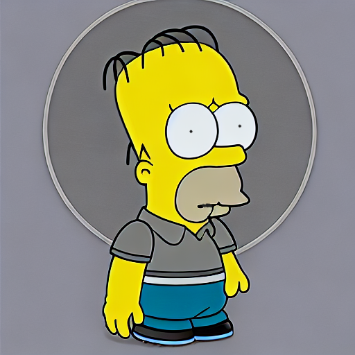
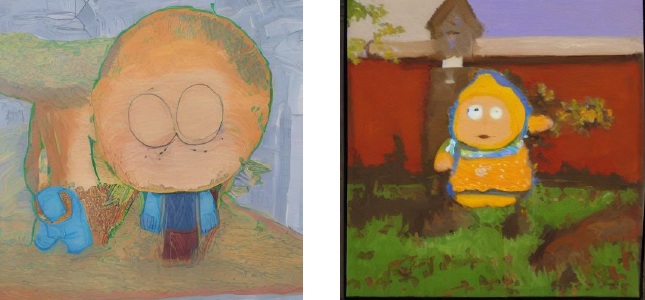
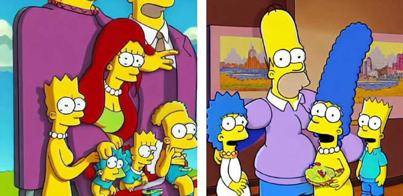
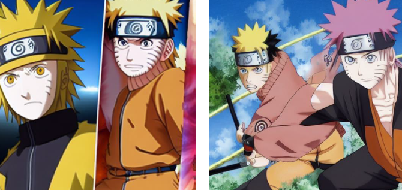
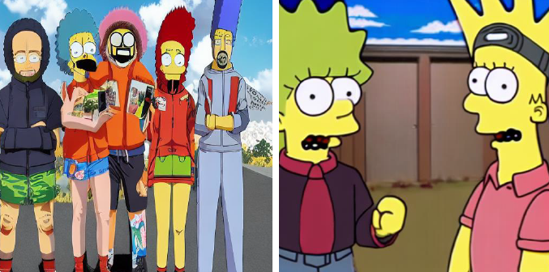

<div align="center">

## Stable Diffusion Art Generation using the InvokeAI Codebase




</div>

## Table of Contents

1. **Art Generation Results**
2. **Installation**
3. **Hardware Requirements**
4. **Fine-tuning for Art Generation**


## 1. Art Generation Results

Below, we can see some examples of generated art during the process of fine-tuning.







## 2. Getting Started with InvokeAI

For full installation and upgrade instructions, please see:
[InvokeAI Installation Overview](https://invoke-ai.github.io/InvokeAI/installation/)

### Automatic Installer (suggested for 1st time users)

1. Go to the bottom of the [Latest Release Page](https://github.com/invoke-ai/InvokeAI/releases/latest)

2. Download the .zip file for your OS (Windows/macOS/Linux).

3. Unzip the file.

4. If you are on Windows, double-click on the `install.bat` script. On
macOS, open a Terminal window, drag the file `install.sh` from Finder
into the Terminal, and press return. On Linux, run `install.sh`.

5. You'll be asked to confirm the location of the folder in which
to install InvokeAI and its image generation model files. Pick a
location with at least 15 GB of free memory. More if you plan on
installing lots of models.

6. Wait while the installer does its thing. After installing the software,
the installer will launch a script that lets you configure InvokeAI and
select a set of starting image generaiton models.

7. Find the folder that InvokeAI was installed into (it is not the
same as the unpacked zip file directory!) The default location of this
folder (if you didn't change it in step 5) is `~/invokeai` on
Linux/Mac systems, and `C:\Users\YourName\invokeai` on Windows. This directory will contain launcher scripts named `invoke.sh` and `invoke.bat`.

8. On Windows systems, double-click on the `invoke.bat` file. On
macOS, open a Terminal window, drag `invoke.sh` from the folder into
the Terminal, and press return. On Linux, run `invoke.sh`

9. Press 2 to open the "browser-based UI", press enter/return, wait a
minute or two for Stable Diffusion to start up, then open your browser
and go to http://localhost:9090.

10. Type `banana sushi` in the box on the top left and click `Invoke`

## 2. Command-Line Installation (for users familiar with Terminals)

You must have Python 3.9 or 3.10 installed on your machine. Earlier or later versions are
not supported.

1. Open a command-line window on your machine. The PowerShell is recommended for Windows.
2. Create a directory to install InvokeAI into. You'll need at least 15 GB of free space:

    ```terminal
    mkdir invokeai
    ````

3. Create a virtual environment named `.venv` inside this directory and activate it:

    ```terminal
    cd invokeai
    python -m venv .venv --prompt InvokeAI
    ```

4. Activate the virtual environment (do it every time you run InvokeAI)

    _For Linux/Mac users:_

    ```sh
    source .venv/bin/activate
    ```

    _For Windows users:_

    ```ps
    .venv\Scripts\activate
    ```

5. Install the InvokeAI module and its dependencies. Choose the command suited for your platform & GPU.

    _For Windows/Linux with an NVIDIA GPU:_

    ```terminal
    pip install InvokeAI[xformers] --use-pep517 --extra-index-url https://download.pytorch.org/whl/cu117
    ```

    _For Linux with an AMD GPU:_

    ```sh
    pip install InvokeAI --use-pep517 --extra-index-url https://download.pytorch.org/whl/rocm5.2
    ```

    _For Macintoshes, either Intel or M1/M2:_

    ```sh
    pip install InvokeAI --use-pep517
    ```

6. Configure InvokeAI and install a starting set of image generation models (you only need to do this once):

    ```terminal
    invokeai-configure
    ```

7. Launch the web server (do it every time you run InvokeAI):

    ```terminal
    invokeai --web
    ```

8. Point your browser to http://localhost:9090 to bring up the web interface.
9. Type `banana sushi` in the box on the top left and click `Invoke`.

Be sure to activate the virtual environment each time before re-launching InvokeAI,
using `source .venv/bin/activate` or `.venv\Scripts\activate`.

### Detailed Installation Instructions

This fork is supported across Linux, Windows and Macintosh. Linux
users can use either an Nvidia-based card (with CUDA support) or an
AMD card (using the ROCm driver). For full installation and upgrade
instructions, please see:
[InvokeAI Installation Overview](https://invoke-ai.github.io/InvokeAI/installation/INSTALL_SOURCE/)

## 3. Hardware Requirements

InvokeAI is supported across Linux, Windows and macOS. Linux
users can use either an Nvidia-based card (with CUDA support) or an
AMD card (using the ROCm driver).

You will need one of the following:

- An NVIDIA-based graphics card with 4 GB or more VRAM memory.
- An Apple computer with an M1 chip.
- An AMD-based graphics card with 4GB or more VRAM memory. (Linux only)

We do not recommend the GTX 1650 or 1660 series video cards. They are
unable to run in half-precision mode and do not have sufficient VRAM
to render 512x512 images.


## 4. Fine-tuning for Art Generation

### 4.1. Allowing for download of models

In order to allow for download of models (which is absolutely necessary as they do are not included in the codebase) you must make a few changes. Go to `ldm/modules/encoders/modules/py` and set the `local_files_only` flag to `False` in `BERTTokenizer` and `FrozenCLIPEmbedder`.

The fine-tuning process cannot start without these models being present.

### 4.2. Importing Stable-Diffusion and other models checkpoints

The above step downloaded models automatically. For some other models, we are forced to copy them manually in the codebase.

- We have to create a `models` directory in the root folder of the repo.
- Inside it we will have 2 directories: `gfpgan` and `ldm`.
- Inside the `ldm` we create a folder named `stable-diffusion-v1`.

As the name suggest, we will have to place the mdoel checkpoints in their respective folders. 

| Model Name   |      Location      |  Link |
|----------|:-------------:|------:|
| Codeformer |  ldm/invoke/restoration/codeformer/weights/codeformer.pth | [link](https://huggingface.co/spaces/sczhou/CodeFormer)
| GFPGAN |    models\gfpgan\GFPGANv1.4.pth   |   [link](https://huggingface.co/TencentARC/GFPGANv1) |
| Stable Diffusion v1.5| models\ldm\stable-diffusion-v1\model.ckpt |    [link](https://huggingface.co/runwayml/stable-diffusion-v1-5) |

*the Stable Diffusion model chosen should be the one optimised for fine-tuning, not inference.

### 4.3. Training Data

I also created a directory named `training_data` in the root folder of the repo. This is where we will store the raw and processed training data. 

Raw images are the ones procured from the internet. I leveraged the `Preprocess_Images.ipynb` to bring my images to the 512*512 resolution. 

Processed images, in the case of my art generation, are stored in different sub-directories based on style.

### 4.4. Config Files

Config files can be found in the `config` directory. There are 2 main config files we are mainly interested in:

- `stable-diffusion/v1-finetune_style.yaml`
- `models.yaml`

The `models` config can be left as is, it's used for "knowing" where to find the varios models.

The `v1-finetune_style.yaml` config will dictate how the entire fine-tuning process will proceed. This amazing [Medium Article](https://towardsdatascience.com/how-to-fine-tune-stable-diffusion-using-textual-inversion-b995d7ecc095)  goes over the importance of various parameters found within the config file.

### 4.5. Starting the Fine-Tuning Process (cmd)
Before running the below command, make sure you have activated your invokeai environment.

The command below is a working example I used in order to generate a style embedding using South Park. The generated embedding would later be used for inference (and implicitly new Art Generation).
```
python main.py --base configs\stable-diffusion\v1-finetune_style.yaml \
                -t \
                --actual_resume models\ldm\stable-diffusion-v1\model.ckpt \
                -n my_key \
                --gpus 0, \
                --data_root .\training_data\processed\style_south_park

```
The `my_key` parameter should probably be replaced with something more suggestive - when generating the embedding folder, you will wish to have a uniquely identifiable name. In this case, a good key name might be `south_park_art_generation_7000_steps`.

### 4.6. Performing Inference

In order to start the `txt2img` prompt-to-image generation process, you would have to run a command in the style (pun intended) of:
```
python ./scripts/invoke.py --embedding_path /path/to/embeddings.pt
```

A working example for me was:
```
python scripts\invoke.py --embedding_path logs\style_cartoons2022-12-20T18-37-23_15ksteps_cartoons\checkpoints\embeddings.pt
```

I have uploaded all my logs generated throughout my experiments. These logs contain generated embeddings (during the fine-tuning process), alongside train-validation images. They can be found in the `logs` directory.
